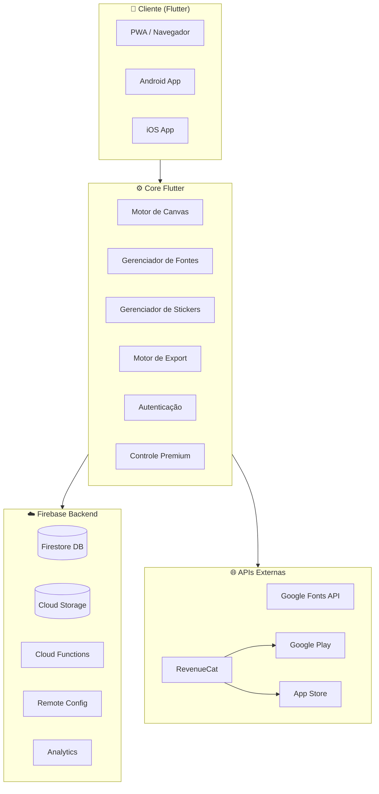
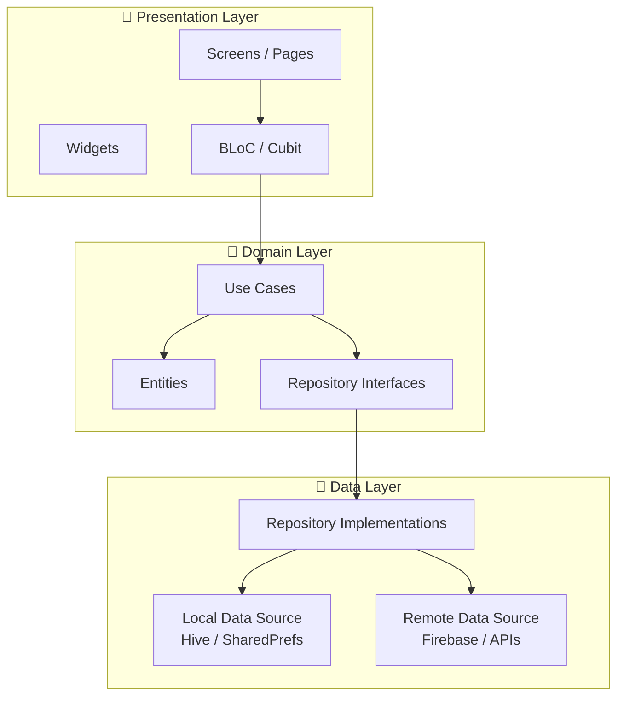
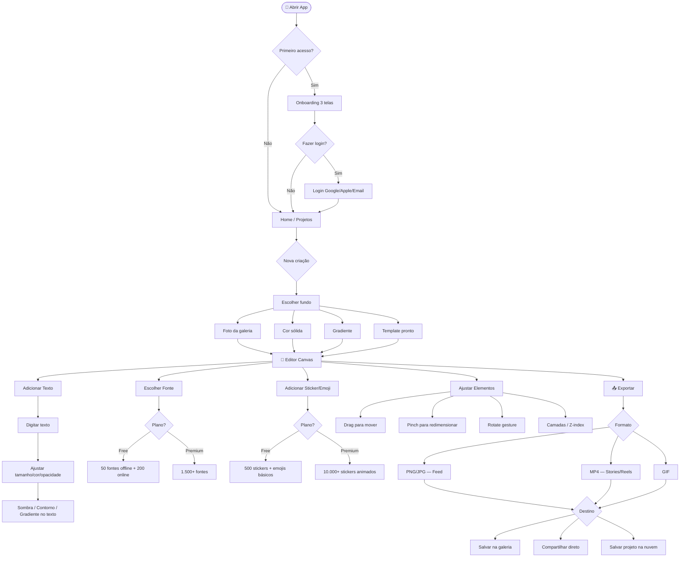
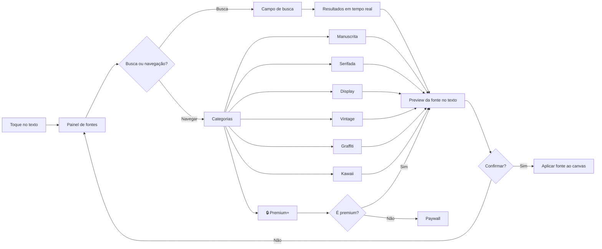
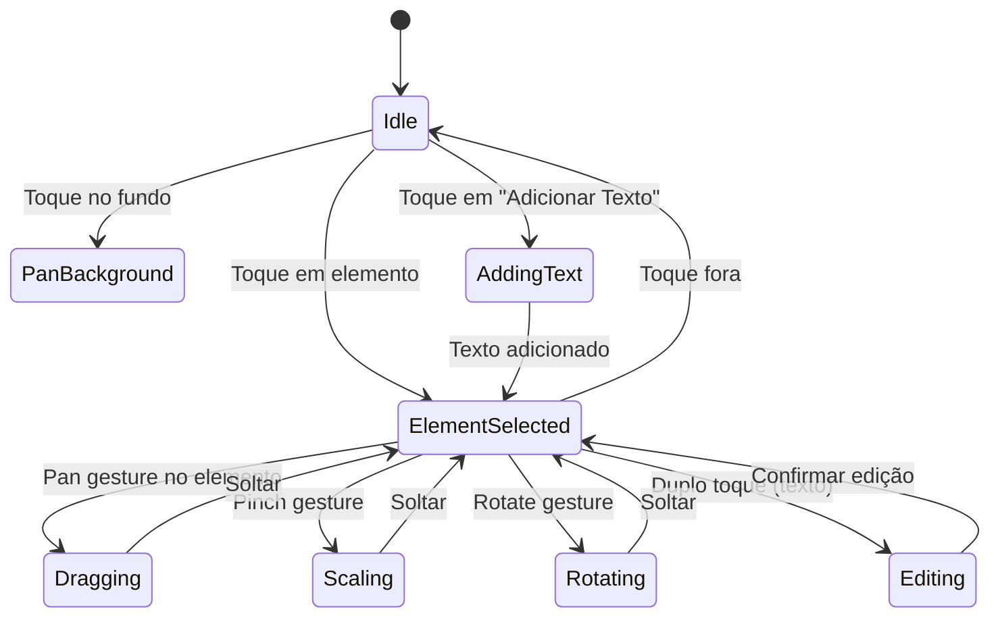
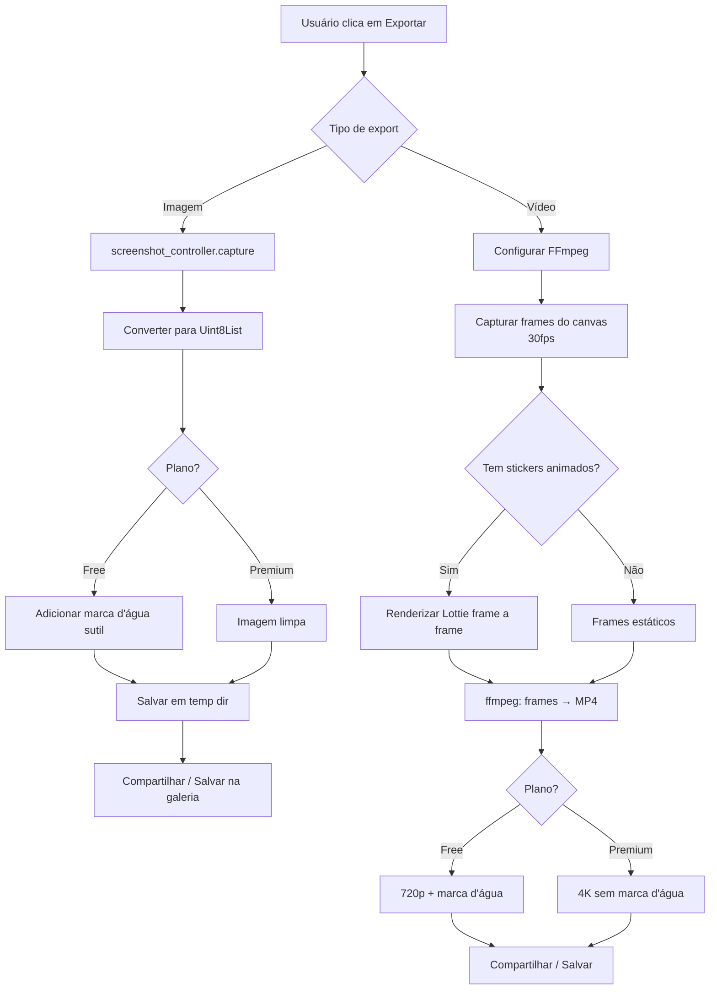
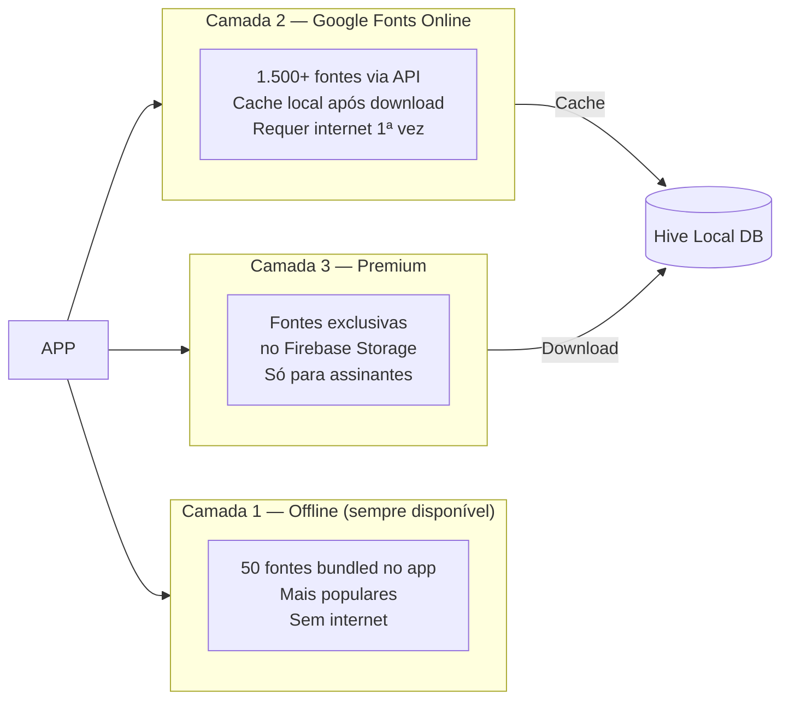
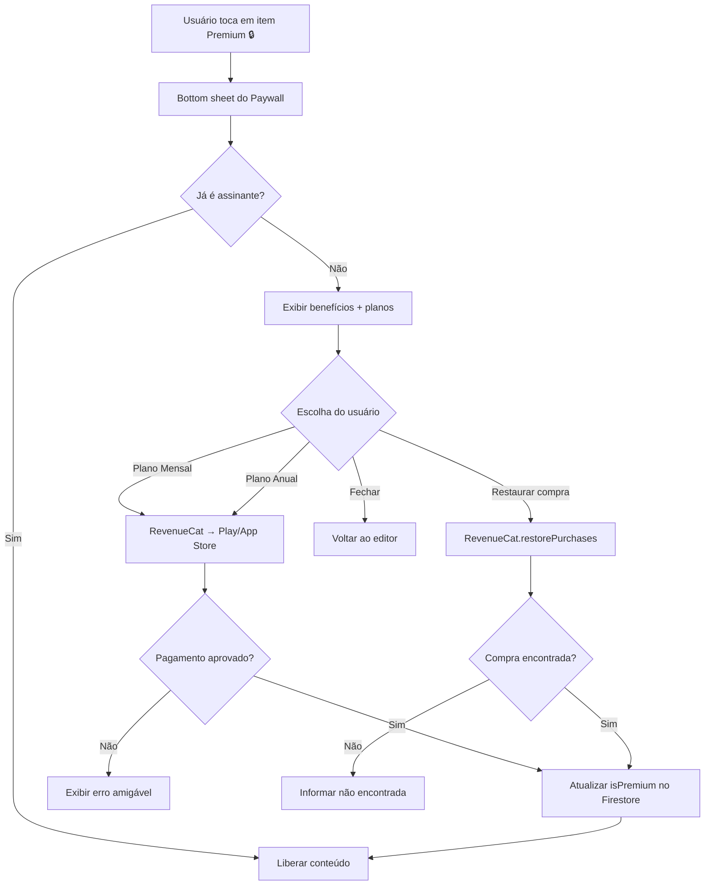
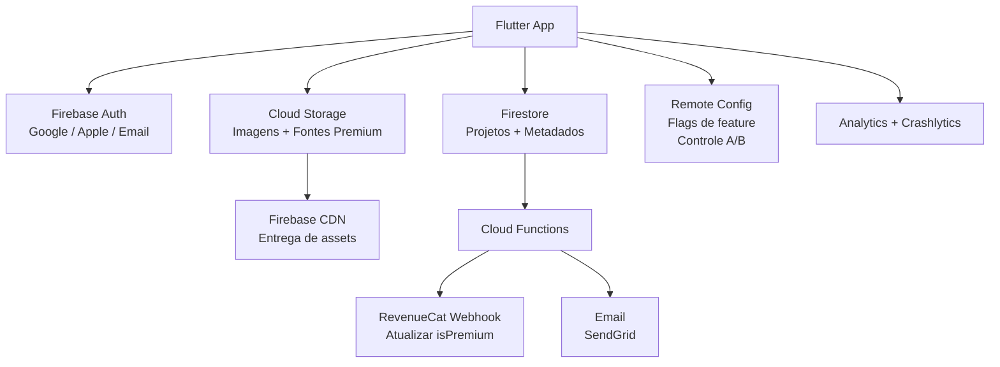
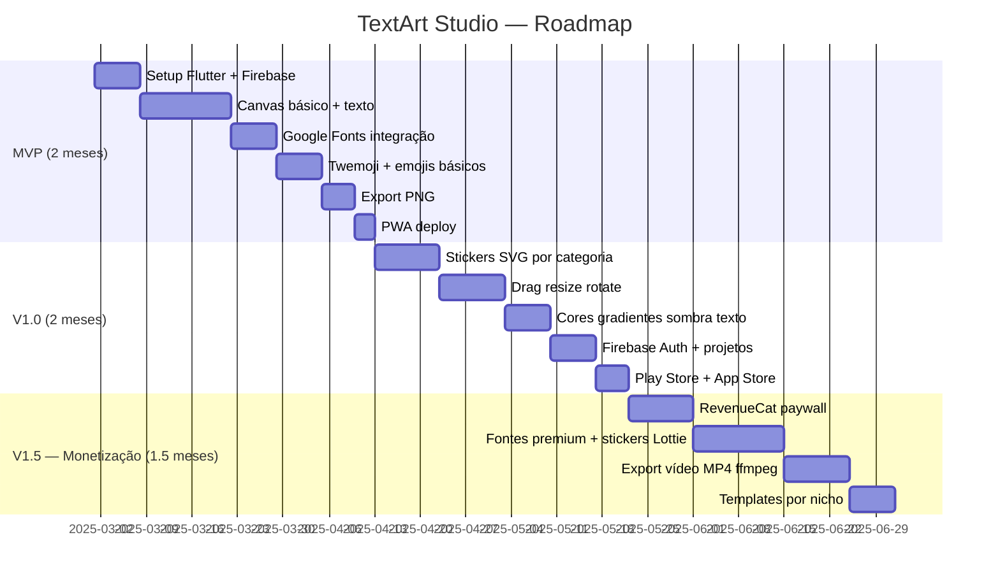

# 🎨 TextArt Studio — Planejamento Técnico Completo

> **Versão:** 1.0 | **Stack:** Flutter (PWA + Android + iOS) | **Modelo:** Freemium  
> **Objetivo:** App de edição de texto sobre fotos/vídeos com máxima variedade de fontes, emojis e stickers

---

## Sumário

1. [Visão Geral do Produto](#1-visão-geral-do-produto)
2. [Arquitetura do Sistema](#2-arquitetura-do-sistema)
3. [Fluxo de Usuário (User Flow)](#3-fluxo-de-usuário-user-flow)
4. [Estrutura de Dados](#4-estrutura-de-dados)
5. [Motor de Canvas — Lógica Central](#5-motor-de-canvas--lógica-central)
6. [Sistema de Fontes](#6-sistema-de-fontes)
7. [Sistema de Stickers & Emojis](#7-sistema-de-stickers--emojis)
8. [Modelo Freemium & Monetização](#8-modelo-freemium--monetização)
9. [Wireframes das Telas](#9-wireframes-das-telas)
10. [Backend & Infraestrutura](#10-backend--infraestrutura)
11. [Roadmap de Desenvolvimento](#11-roadmap-de-desenvolvimento)
12. [Estimativa de Custos](#12-estimativa-de-custos)

---

## 1. Visão Geral do Produto

### 1.1 Proposta de Valor

```bash
TextArt Studio = Editor de Texto Criativo
│
├── Maior catálogo de fontes gratuitas do mercado
├── 10.000+ emojis, stickers e elementos visuais
├── Canvas intuitivo: arrastar, redimensionar, rotacionar
├── Export para imagem (feed) e vídeo (Stories, Reels, TikTok)
└── Funciona offline com conteúdo básico
```

### 1.2 Público-Alvo

| Perfil | Uso Principal | Frequência |
|-- -|---|---|
| Criadores de conteúdo | Posts motivacionais, quotes | Diária |
| Pequenos negócios | Promoções, anúncios | 3-5x/semana |
| Estudantes | Projetos, apresentações | Semanal |
| Usuários casuais | Datas comemorativas, memes | Mensal |

### 1.3 Diferenciais vs Concorrentes

| Feature | TextArt Studio | Canva | Over | Legend |
|- --|---|---|---|---|
| Foco em fontes | ✅ 1.500+ | ⚠️ 500+ | ⚠️ 200+ | ⚠️ 300+ |
| PWA + Android + iOS | ✅ | ✅ | ❌ | ❌ |
| Offline first | ✅ | ❌ | ⚠️ | ❌ |
| Export vídeo animado | ✅ | ✅ | ✅ | ✅ |
| Preço (premium) | R$14,90/mês | R$54,90/mês | R$29,90/mês | R$24,90/mês |
| Stickers animados | ✅ | ✅ | ⚠️ | ✅ |

---

## 2. Arquitetura do Sistema

### 2.1 Visão Macro



### 2.2 Arquitetura de Camadas (Clean Architecture)



### 2.3 Estrutura de Pastas do Projeto

```bash
textart_studio/
│
├── lib/
│   ├── main.dart
│   ├── app.dart
│   │
│   ├── core/
│   │   ├── constants/
│   │   │   ├── app_colors.dart
│   │   │   ├── app_sizes.dart
│   │   │   └── api_keys.dart
│   │   ├── errors/
│   │   │   ├── failures.dart
│   │   │   └── exceptions.dart
│   │   ├── utils/
│   │   │   ├── image_utils.dart
│   │   │   └── file_utils.dart
│   │   └── theme/
│   │       └── app_theme.dart
│   │
│   ├── features/
│   │   │
│   │   ├── editor/                     # Canvas principal
│   │   │   ├── data/
│   │   │   │   ├── models/
│   │   │   │   │   ├── canvas_element.dart
│   │   │   │   │   ├── text_element.dart
│   │   │   │   │   └── sticker_element.dart
│   │   │   │   └── repositories/
│   │   │   │       └── project_repository_impl.dart
│   │   │   ├── domain/
│   │   │   │   ├── entities/
│   │   │   │   │   └── project.dart
│   │   │   │   ├── repositories/
│   │   │   │   │   └── project_repository.dart
│   │   │   │   └── usecases/
│   │   │   │       ├── save_project.dart
│   │   │   │       ├── load_project.dart
│   │   │   │       └── export_image.dart
│   │   │   └── presentation/
│   │   │       ├── bloc/
│   │   │       │   ├── editor_bloc.dart
│   │   │       │   └── editor_state.dart
│   │   │       ├── pages/
│   │   │       │   └── editor_page.dart
│   │   │       └── widgets/
│   │   │           ├── canvas_widget.dart
│   │   │           ├── element_controls.dart
│   │   │           └── toolbar_widget.dart
│   │   │
│   │   ├── fonts/                      # Catálogo de fontes
│   │   │   ├── data/
│   │   │   │   ├── models/font_model.dart
│   │   │   │   └── repositories/font_repository_impl.dart
│   │   │   ├── domain/
│   │   │   │   ├── entities/font_entity.dart
│   │   │   │   └── usecases/
│   │   │   │       ├── load_google_fonts.dart
│   │   │   │       └── search_fonts.dart
│   │   │   └── presentation/
│   │   │       ├── bloc/font_bloc.dart
│   │   │       ├── pages/font_picker_page.dart
│   │   │       └── widgets/font_preview_card.dart
│   │   │
│   │   ├── stickers/                   # Emojis e stickers
│   │   │   ├── data/
│   │   │   │   ├── models/sticker_model.dart
│   │   │   │   └── repositories/sticker_repository_impl.dart
│   │   │   ├── domain/
│   │   │   │   └── usecases/
│   │   │   │       ├── get_stickers_by_category.dart
│   │   │   │       └── search_stickers.dart
│   │   │   └── presentation/
│   │   │       ├── bloc/sticker_bloc.dart
│   │   │       ├── pages/sticker_picker_page.dart
│   │   │       └── widgets/sticker_grid.dart
│   │   │
│   │   ├── export/                     # Exportar imagem/vídeo
│   │   │   ├── domain/
│   │   │   │   └── usecases/
│   │   │   │       ├── export_to_image.dart
│   │   │   │       └── export_to_video.dart
│   │   │   └── presentation/
│   │   │       ├── bloc/export_bloc.dart
│   │   │       └── widgets/export_options_sheet.dart
│   │   │
│   │   ├── auth/                       # Login
│   │   │   └── presentation/
│   │   │       └── pages/login_page.dart
│   │   │
│   │   └── premium/                    # Assinatura
│   │       ├── domain/
│   │       │   └── usecases/
│   │       │       ├── check_premium_status.dart
│   │       │       └── restore_purchases.dart
│   │       └── presentation/
│   │           └── pages/paywall_page.dart
│   │
│   └── shared/
│       ├── widgets/
│       │   ├── loading_widget.dart
│       │   └── premium_badge.dart
│       └── providers/
│           └── premium_provider.dart
│
├── assets/
│   ├── fonts/                          # 50 fontes offline (subset)
│   ├── stickers/
│   │   ├── twemoji/                    # Emojis (SVG)
│   │   ├── openmoji/                   # Emojis alternativos
│   │   ├── fluent/                     # Fluent Emoji (Microsoft)
│   │   └── shapes/                     # Formas geométricas (SVG)
│   └── lottie/                         # Stickers animados
│
├── pubspec.yaml
└── firebase.json
```

---

## 3. Fluxo de Usuário (User Flow)

### 3.1 Fluxo Principal



### 3.2 Fluxo de Seleção de Fonte



---

## 4. Estrutura de Dados

### 4.1 Modelo de Projeto (Firestore)

```dart
// Entidade principal de um projeto
class Project {
  final String id;
  final String userId;
  final String title;
  final DateTime createdAt;
  final DateTime updatedAt;
  final CanvasConfig canvas;
  final List<CanvasElement> elements;  // Texto + Stickers
  final ExportConfig exportConfig;
  final bool isSynced;
}

// Configuração do canvas
class CanvasConfig {
  final double width;           // 1080px padrão
  final double height;          // 1080px (1:1), 1920px (9:16)
  final BackgroundType type;    // image, color, gradient
  final String? backgroundPath; // caminho da imagem
  final Color? backgroundColor;
  final Gradient? gradient;
}

// Elemento genérico do canvas
abstract class CanvasElement {
  final String id;
  final double x;
  final double y;
  final double width;
  final double height;
  final double rotation;   // em graus
  final double opacity;
  final int zIndex;        // ordem das camadas
}

// Elemento de texto
class TextElement extends CanvasElement {
  final String text;
  final String fontFamily;
  final double fontSize;
  final Color color;
  final TextAlign alignment;
  final TextStyle style;        // bold, italic, etc
  final TextDecoration decoration;
  final ShadowConfig? shadow;
  final StrokeConfig? stroke;   // contorno
  final bool hasGradient;
  final List<Color>? gradientColors;
}

// Elemento de sticker/emoji
class StickerElement extends CanvasElement {
  final String stickerPath;     // caminho local ou URL
  final StickerType type;       // svg, png, lottie
  final bool isAnimated;
  final bool isPremium;
}
```

### 4.2 Estrutura no Firestore

```bash
firestore/
│
├── users/{userId}/
│   ├── displayName: string
│   ├── email: string
│   ├── isPremium: boolean
│   ├── premiumExpiresAt: timestamp
│   └── projectCount: number
│
├── projects/{projectId}/
│   ├── userId: string
│   ├── title: string
│   ├── thumbnailUrl: string
│   ├── canvasJson: string        # JSON serializado
│   ├── createdAt: timestamp
│   ├── updatedAt: timestamp
│   └── isPublic: boolean
│
└── content/
    ├── fonts/{fontId}/
    │   ├── name: string
    │   ├── family: string
    │   ├── category: string
    │   ├── isPremium: boolean
    │   └── previewUrl: string
    │
    └── stickers/{stickerId}/
        ├── name: string
        ├── category: string
        ├── type: string          # svg, png, lottie
        ├── url: string
        ├── isPremium: boolean
        └── tags: array<string>
```

---

## 5. Motor de Canvas — Lógica Central

### 5.1 Diagrama de Camadas do Canvas

```bash
┌─────────────────────────────────────────────┐
│               CANVAS (1080 x 1080)          │
│                                             │
│  ┌─────────────────────────────────────┐   │
│  │  Layer 5: UI Controls (não exporta)  │   │
│  │  [handles de resize] [botão delete]  │   │
│  └─────────────────────────────────────┘   │
│  ┌─────────────────────────────────────┐   │
│  │  Layer 4: Elementos Selecionados     │   │
│  │  [borda de seleção ativa]            │   │
│  └─────────────────────────────────────┘   │
│  ┌─────────────────────────────────────┐   │
│  │  Layer 3: Textos                     │   │
│  │  [TextElement 1] [TextElement 2]     │   │
│  └─────────────────────────────────────┘   │
│  ┌─────────────────────────────────────┐   │
│  │  Layer 2: Stickers & Emojis          │   │
│  │  [StickerElement] [EmojiElement]     │   │
│  └─────────────────────────────────────┘   │
│  ┌─────────────────────────────────────┐   │
│  │  Layer 1: Filtros / Overlay          │   │
│  │  [gradiente, vinheta, blur]          │   │
│  └─────────────────────────────────────┘   │
│  ┌─────────────────────────────────────┐   │
│  │  Layer 0: Fundo (Background)         │   │
│  │  [imagem / cor / gradiente]          │   │
│  └─────────────────────────────────────┘   │
└─────────────────────────────────────────────┘
```

### 5.2 Lógica de Gestos



### 5.3 Sistema de Undo/Redo

```dart
class HistoryManager {
  final List<EditorState> _history = [];
  int _currentIndex = -1;
  static const int maxHistory = 30;

  void push(EditorState state) {
    // Remove estados à frente do índice atual
    if (_currentIndex < _history.length - 1) {
      _history.removeRange(_currentIndex + 1, _history.length);
    }
    
    // Limita o histórico a 30 estados
    if (_history.length >= maxHistory) {
      _history.removeAt(0);
    }
    
    _history.add(state.copyWith());
    _currentIndex = _history.length - 1;
  }

  EditorState? undo() {
    if (_currentIndex > 0) {
      _currentIndex--;
      return _history[_currentIndex];
    }
    return null;
  }

  EditorState? redo() {
    if (_currentIndex < _history.length - 1) {
      _currentIndex++;
      return _history[_currentIndex];
    }
    return null;
  }
}
```

### 5.4 Pipeline de Export



---

## 6. Sistema de Fontes

### 6.1 Arquitetura em 3 Camadas



### 6.2 Catálogo de Categorias

```bash
📂 FONTES GRATUITAS (Google Fonts)
│
├── ✍️  Manuscrita / Handwriting
│   ├── Dancing Script       ← popular, feminina
│   ├── Pacifico             ← retrô, divertida
│   ├── Great Vibes          ← elegante, cursiva
│   ├── Caveat               ← natural, orgânica
│   └── Sacramento           ← sofisticada
│
├── 📰 Serifada / Elegante
│   ├── Playfair Display     ← editorial, luxo
│   ├── Merriweather         ← leitura, clássica
│   ├── Lora                 ← elegante, moderna
│   └── Cormorant Garamond   ← alta costura
│
├── 💥 Display / Impacto
│   ├── Bebas Neue           ← esportiva, impacto
│   ├── Anton                ← negrito, chamativa
│   ├── Righteous            ← geométrica, forte
│   └── Black Han Sans       ← pesada, bold
│
├── 🕰️  Vintage / Retrô
│   ├── Abril Fatface        ← pôster, vintage
│   ├── Alfa Slab One        ← retrô, sólida
│   ├── Rye                  ← faroeste, western
│   └── Monoton              ← néon, 80s
│
├── 🏙️  Minimalista / Clean
│   ├── Poppins              ← moderna, geométrica
│   ├── Raleway              ← clean, thin
│   ├── Nunito               ← suave, arredondada
│   └── Inter                ← profissional
│
├── 🎭 Graffiti / Street
│   ├── Permanent Marker     ← marcador, street
│   ├── Knewave              ← graffiti suave
│   └── Boogaloo             ← descontraída
│
├── 🌸 Kawaii / Cute
│   ├── Fredoka One          ← infantil, fofa
│   ├── Bubblegum Sans       ← bolhas, divertida
│   └── Chewy                ← cartoon
│
└── 🔒 PREMIUM EXCLUSIVAS
    ├── [Pacotes Creative Market]
    ├── [Fontes Sazonais — Natal, Halloween]
    └── [Novas fontes mensais]
```

### 6.3 Lógica de Carregamento de Fonte

```dart
class FontManager {
  final Map<String, TextStyle> _cache = {};
  
  Future<TextStyle> loadFont(FontEntity font) async {
    // 1. Verificar cache em memória
    if (_cache.containsKey(font.family)) {
      return _cache[font.family]!;
    }
    
    // 2. Verificar se está no bundle local
    if (font.isLocal) {
      final style = _loadLocalFont(font);
      _cache[font.family] = style;
      return style;
    }
    
    // 3. Verificar cache no Hive (download anterior)
    final cached = await HiveFontCache.get(font.family);
    if (cached != null) {
      return _buildStyleFromBytes(cached);
    }
    
    // 4. Verificar premium
    if (font.isPremium && !await PremiumService.isPremium()) {
      throw PremiumRequiredException(fontFamily: font.family);
    }
    
    // 5. Download da fonte
    final fontData = await _downloadFont(font);
    
    // 6. Salvar no cache local
    await HiveFontCache.save(font.family, fontData);
    
    final style = _buildStyleFromBytes(fontData);
    _cache[font.family] = style;
    return style;
  }
}
```

---

## 7. Sistema de Stickers & Emojis

### 7.1 Fontes de Conteúdo

| Biblioteca | Tipo | Qtd | Licença | Uso no App |
|- --|---|---|---|---|
| Twemoji (Twitter/X) | Emoji SVG | 3.600+ | MIT | Free |
| OpenMoji | Emoji SVG/PNG | 4.000+ | CC BY-SA 4.0 | Free |
| Fluent Emoji (Microsoft) | Emoji SVG | 1.800+ | MIT | Free |
| Noto Emoji (Google) | PNG | 3.600+ | OFL | Free |
| SVGRepo | Ícones/Formas | 500k+ | MIT/CC | Free + Premium |
| LottieFiles (free tier) | Animados JSON | 5.000+ | Variada | Premium |
| Flaticon | Stickers PNG | 1M+ | Free c/ atrib | Free + Premium |

### 7.2 Categorias de Stickers

```bash
📦 STICKERS FREE (500+)
├── 😀 Emojis Clássicos (Twemoji)
│   ├── Caras e expressões
│   ├── Gestos e mãos
│   ├── Corações e sentimentos
│   └── Natureza e animais
│
├── ⭐ Formas & Decorações
│   ├── Estrelas, corações, setas
│   ├── Formas geométricas
│   └── Bordas e molduras simples
│
├── 🎉 Festividades Básicas
│   ├── Aniversário
│   ├── Natal
│   └── Ano Novo
│
└── 🔥 Trending Básicos
    ├── Fire, Sparkle, Lightning
    └── Check, X, Info

📦 STICKERS PREMIUM (10.000+)
├── 🎬 Animados (Lottie)
│   ├── Emojis em movimento
│   ├── Confetes e partículas
│   └── Efeitos especiais
│
├── 🎨 Coleções Temáticas
│   ├── Aesthetic / VSCO
│   ├── Kawaii / Anime
│   ├── Fitness & Motivação
│   ├── Negócios & Profissional
│   ├── Halloween, Natal, Páscoa (sazonais)
│   └── Street Art / Graffiti
│
├── 🖼️ Molduras & Frames
│   ├── Polaroid
│   ├── Neon borders
│   └── Vintage frames
│
└── ✨ Efeitos de Texto Decorativos
    ├── Underlines estilizados
    ├── Highlight / marca texto
    └── Setas e connectors
```

### 7.3 Lógica de Busca e Filtragem

```dart
class StickerRepository {
  // Índice local em Hive para busca offline
  final HiveIndex _localIndex;
  
  Future<List<StickerModel>> search({
    required String query,
    String? category,
    bool? isPremium,
    StickerType? type,
    int page = 0,
    int limit = 40,
  }) async {
    // Busca no índice local primeiro (offline)
    var results = await _localIndex.search(
      query: query,
      filters: {
        if (category != null) 'category': category,
        if (isPremium != null) 'isPremium': isPremium,
        if (type != null) 'type': type.name,
      },
    );
    
    // Se poucas results locais, complementa com Firestore
    if (results.length < 10) {
      final remote = await _fetchFromFirestore(
        query: query,
        category: category,
        page: page,
        limit: limit - results.length,
      );
      results = [...results, ...remote];
    }
    
    return results
      .skip(page * limit)
      .take(limit)
      .toList();
  }
}
```

---

## 8. Modelo Freemium & Monetização

### 8.1 Comparativo de Planos

| Feature | 🆓 Free | ⭐ Premium |
|- --|---|---|
| Fontes | 200 (50 offline + 150 online) | 1.500+ |
| Stickers estáticos | 500 | 10.000+ |
| Stickers animados | ❌ | ✅ |
| Projetos salvos | 3 | Ilimitados |
| Export imagem | 720p com marca d'água discreta | 4K sem marca d'água |
| Export vídeo | 720p com marca d'água | 4K sem marca d'água |
| Templates | 10 básicos | 200+ |
| Fontes novas por mês | ❌ | ✅ Novos drops |
| Suporte | Email | Prioritário |

### 8.2 Precificação

```bash
💰 PLANOS PREMIUM

  Mensal:     R$ 14,90/mês
  Anual:      R$ 89,90/ano  (economia de 50% → R$ 7,49/mês)
  Vitalício:  R$ 197,00 (oferta de lançamento)
```

### 8.3 Fluxo do Paywall



### 8.4 Implementação RevenueCat

```dart
class PremiumService {
  static Future<void> initialize() async {
    await Purchases.setLogLevel(LogLevel.debug);
    await Purchases.configure(
      PurchasesConfiguration(
        Platform.isAndroid
            ? 'goog_XXX'   // Google Play key
            : 'appl_XXX',  // App Store key
      ),
    );
  }

  static Future<bool> isPremium() async {
    final info = await Purchases.getCustomerInfo();
    return info.entitlements.active.containsKey('premium');
  }

  static Future<void> subscribe(Package package) async {
    try {
      await Purchases.purchasePackage(package);
    } on PurchasesErrorCode catch (e) {
      if (e == PurchasesErrorCode.purchaseCancelledError) return;
      rethrow;
    }
  }
}
```

---

## 9. Wireframes das Telas

### 9.1 Home — Lista de Projetos

```bash
┌─────────────────────────────────┐
│ TextArt Studio           👤 [≡] │
├─────────────────────────────────┤
│                                 │
│  ┌──────────────────────────┐   │
│  │  + Novo Projeto           │   │
│  └──────────────────────────┘   │
│                                 │
│  Recentes                       │
│                                 │
│  ┌──────────┐  ┌──────────┐    │
│  │          │  │          │    │
│  │ [img]    │  │ [img]    │    │
│  │          │  │          │    │
│  │ Projeto 1│  │ Projeto 2│    │
│  │ 2h atrás │  │ ontem    │    │
│  └──────────┘  └──────────┘    │
│                                 │
│  ┌──────────┐  ┌──────────┐    │
│  │          │  │          │    │
│  │ [img]    │  │ [img]    │    │
│  │          │  │          │    │
│  │ Projeto 3│  │ Projeto 4│    │
│  │ 3 dias   │  │ 1 semana │    │
│  └──────────┘  └──────────┘    │
│                                 │
│  [Explorar Templates]           │
│                                 │
└─────────────────────────────────┘
```

### 9.2 Seleção de Fundo

```bash
┌─────────────────────────────────┐
│ ← Novo Projeto                  │
├─────────────────────────────────┤
│                                 │
│  Escolha o fundo                │
│                                 │
│  ┌────────────────────────────┐ │
│  │  📷 Escolher da Galeria    │ │
│  └────────────────────────────┘ │
│                                 │
│  ┌────────────────────────────┐ │
│  │  📹 Escolher Vídeo         │ │
│  └────────────────────────────┘ │
│                                 │
│  Cor Sólida                     │
│  ● ● ● ● ● ● ● ● ● [+custom]  │
│                                 │
│  Gradiente                      │
│  ┌───┐ ┌───┐ ┌───┐ ┌───┐      │
│  │▓▓▓│ │▒▒▒│ │░░░│ │▓░▒│      │
│  └───┘ └───┘ └───┘ └───┘      │
│                                 │
│  Formato de Export              │
│  [1:1]  [9:16]  [4:5]  [16:9] │
│                                 │
│  ┌────────────────────────────┐ │
│  │  → Começar a Editar        │ │
│  └────────────────────────────┘ │
└─────────────────────────────────┘
```

### 9.3 Editor Principal (Canvas)

```bash
┌─────────────────────────────────┐
│ ← [↩][↪]         [💾] [📤]     │  ← Undo/Redo + Salvar + Exportar
├─────────────────────────────────┤
│                                 │
│ ┌──────────────────────────────┐│
│ │                              ││  ← Canvas
│ │    [Foto de fundo]           ││
│ │                              ││
│ │  ╔═══════════════╗           ││  ← Elemento selecionado
│ │  ║ SUA FRASE     ║ ↻        ││    (com handles)
│ │  ╚═══════════════╝           ││
│ │          ↕ ↔                 ││
│ │                              ││
│ │    🌟    ❤️                   ││  ← Stickers
│ │                              ││
│ └──────────────────────────────┘│
│                                 │
│ [✏️ Texto] [🔤 Fonte] [😀] [🎨] [⋮]│  ← Toolbar principal
├─────────────────────────────────┤
│                                 │
│  (Painel contextual aqui)       │  ← Muda conforme o item selecionado
│                                 │
└─────────────────────────────────┘
```

### 9.4 Painel de Texto (quando texto selecionado)

```bash
┌─────────────────────────────────┐
│ ← [↩][↪]         [💾] [📤]     │
├─────────────────────────────────┤
│                                 │
│ ┌──────────────────────────────┐│
│ │                              ││
│ │    ╔════════════════╗        ││
│ │    ║ SUA FRASE AQUI ║        ││
│ │    ╚════════════════╝        ││
│ │                              ││
│ └──────────────────────────────┘│
│                                 │
│ [✏️ Texto] [🔤 Fonte] [😀] [🎨] [⋮]│
├─────────────────────────────────┤
│ ┌──────────────────────────────┐│
│ │ Aa  Digite seu texto...      ││  ← Campo de edição
│ └──────────────────────────────┘│
│                                 │
│  Tamanho: ──●──────  48px      │
│                                 │
│  Cor: ● ● ● ● ● ● ● [+]       │
│                                 │
│  [B] [I] [U] [S]              │
│                                 │
│  [⬅] [↔] [➡]  ← Alinhamento   │
│                                 │
│  Sombra    ○ ●  (ativo)        │
│  Contorno  ● ○  (inativo)      │
│  Gradiente ● ○  (inativo)      │
└─────────────────────────────────┘
```

### 9.5 Seletor de Fontes

```bash
┌─────────────────────────────────┐
│  Fontes                    [✕]  │
├─────────────────────────────────┤
│  🔍 Buscar fonte...             │
├─────────────────────────────────┤
│  [Todas] [Manuscrita] [Display] │
│  [Serif] [Clean] [Vintage] [+] │
├─────────────────────────────────┤
│                                 │
│  ┌─────────────────────────┐   │
│  │ SUA FRASE (Pacifico)    │   │  ← Preview com o texto atual
│  └─────────────────────────┘   │
│                                 │
│  ┌─────────────────────────┐   │
│  │ SUA FRASE (Dancing S.)  │   │
│  └─────────────────────────┘   │
│                                 │
│  ┌─────────────────────────┐   │
│  │ SUA FRASE (Bebas Neue)  │   │
│  └─────────────────────────┘   │
│                                 │
│  ┌─────────────────────────┐   │
│  │ SUA FRASE (Great V.) 🔒│   │  ← Premium
│  └─────────────────────────┘   │
│                                 │
│  ┌─────────────────────────┐   │
│  │ SUA FRASE (Lobster)     │   │
│  └─────────────────────────┘   │
│                                 │
└─────────────────────────────────┘
```

### 9.6 Seletor de Stickers

```bash
┌─────────────────────────────────┐
│  Stickers & Emojis         [✕]  │
├─────────────────────────────────┤
│  🔍 Buscar...                   │
├─────────────────────────────────┤
│ [😀][⭐][🎉][🌸][🔥][🎬🔒][+] │  ← Categorias
├─────────────────────────────────┤
│                                 │
│  😀  😂  🥰  😎  🤩  😭  😤  │
│  👍  👎  🙌  💪  🤝  👏  🫶  │
│  ❤️   🧡  💛  💚  💙  💜  🖤  │
│  ⭐  🌟  💫  ✨  🎯  🎪  🎨  │
│  🔥  💥  ⚡  🌈  🎵  🎶  🎸  │
│                                 │
│  ┌──────────────────────────┐  │
│  │ 🔒 PREMIUM — Animados    │  │
│  │ [upgrade para desbloquear│  │
│  └──────────────────────────┘  │
│                                 │
└─────────────────────────────────┘
```

### 9.7 Tela de Export

```bash
┌─────────────────────────────────┐
│  Exportar                  [✕]  │
├─────────────────────────────────┤
│                                 │
│  ┌──────────────────────────┐  │
│  │                          │  │
│  │     [Preview da imagem]  │  │
│  │                          │  │
│  └──────────────────────────┘  │
│                                 │
│  Formato                        │
│  ( ) PNG — alta qualidade       │
│  (●) JPG — menor tamanho       │
│  ( ) MP4 — com animações    🔒 │
│                                 │
│  Qualidade                      │
│  (●) 720p — Grátis             │
│  ( ) 1080p                  🔒 │
│  ( ) 4K                     🔒 │
│                                 │
│  ┌──────────────────────────┐  │
│  │  💾 Salvar na Galeria    │  │
│  └──────────────────────────┘  │
│                                 │
│  ┌──────────────────────────┐  │
│  │  📤 Compartilhar         │  │
│  └──────────────────────────┘  │
│                                 │
│  ┌──────────────────────────┐  │
│  │  ☁️ Salvar Projeto na    │  │
│  │     Nuvem                │  │
│  └──────────────────────────┘  │
│                                 │
└─────────────────────────────────┘
```

### 9.8 Paywall

```bash
┌─────────────────────────────────┐
│                            [✕]  │
│                                 │
│         ⭐ TextArt Premium      │
│                                 │
│  ┌──────────────────────────┐  │
│  │  Essa fonte é exclusiva  │  │
│  │  para assinantes Premium │  │
│  └──────────────────────────┘  │
│                                 │
│  ✅ 1.500+ fontes exclusivas    │
│  ✅ 10.000+ stickers animados   │
│  ✅ Export em 4K sem marca d'água│
│  ✅ Projetos ilimitados         │
│  ✅ Novos conteúdos mensais     │
│                                 │
├─────────────────────────────────┤
│                                 │
│  ┌──────────────────────────┐  │
│  │  ⭐ ANUAL — R$ 89,90/ano │  │  ← Destacado (melhor opção)
│  │  R$ 7,49/mês — 50% OFF  │  │
│  └──────────────────────────┘  │
│                                 │
│  ┌──────────────────────────┐  │
│  │  Mensal — R$ 14,90/mês   │  │
│  └──────────────────────────┘  │
│                                 │
│  [Restaurar compra anterior]    │
│                                 │
│  Cancele quando quiser •        │
│  Política de privacidade        │
│                                 │
└─────────────────────────────────┘
```

---

## 10. Backend & Infraestrutura

### 10.1 Diagrama Firebase



### 10.2 Regras de Segurança Firestore

```javascript
rules_version = '2';
service cloud.firestore {
  match /databases/{database}/documents {

    // Projetos — usuário só acessa os próprios
    match /projects/{projectId} {
      allow read, write: if request.auth != null
        && resource.data.userId == request.auth.uid;
      allow create: if request.auth != null
        && request.resource.data.userId == request.auth.uid;
    }

    // Dados do usuário — só o próprio usuário
    match /users/{userId} {
      allow read, write: if request.auth != null
        && request.auth.uid == userId;
    }

    // Catálogo de conteúdo — leitura pública, escrita só admin
    match /content/{document=**} {
      allow read: if true;
      allow write: if request.auth.token.admin == true;
    }
  }
}
```

### 10.3 Cloud Functions Essenciais

```typescript
// Função 1: Webhook RevenueCat → atualizar premium no Firestore
export const revenueCatWebhook = functions.https.onRequest(async (req, res) => {
  const event = req.body;
  const userId = event.app_user_id;

  if (event.type === 'INITIAL_PURCHASE' || event.type === 'RENEWAL') {
    await admin.firestore().doc(`users/${userId}`).update({
      isPremium: true,
      premiumExpiresAt: new Date(event.expiration_at_ms),
    });
  }

  if (event.type === 'EXPIRATION' || event.type === 'CANCELLATION') {
    await admin.firestore().doc(`users/${userId}`).update({
      isPremium: false,
    });
  }

  res.status(200).send('OK');
});

// Função 2: Limitar projetos para usuários free
export const onProjectCreate = functions.firestore
  .document('projects/{projectId}')
  .onCreate(async (snap, context) => {
    const { userId } = snap.data();
    const userDoc = await admin.firestore().doc(`users/${userId}`).get();

    if (!userDoc.data()?.isPremium) {
      const count = await admin.firestore()
        .collection('projects')
        .where('userId', '==', userId)
        .count()
        .get();

      if (count.data().count > 3) {
        await snap.ref.delete();
        throw new functions.https.HttpsError(
          'resource-exhausted',
          'Free plan allows only 3 projects'
        );
      }
    }
  });
```

---

## 11. Roadmap de Desenvolvimento



### 11.1 Detalhamento por Sprint

## **Sprint 1-2 (Semanas 1-4) — Fundação**

- Setup do projeto Flutter com flavors (dev/prod)
- Configuração Firebase (Auth, Firestore, Storage)
- Canvas básico com `flutter_painter_v2`
- Adicionar texto com fonte padrão
- Undo/Redo básico (5 estados)

## **Sprint 3-4 (Semanas 5-8) — Fontes**

- Integrar `google_fonts` package
- UI do seletor de fontes com preview em tempo real
- Sistema de cache com Hive
- Categorias e busca de fontes
- 50 fontes bundled offline

## **Sprint 5-6 (Semanas 9-12) — Stickers**

- Pipeline de carregamento de SVG (flutter_svg)
- Grid de emojis Twemoji
- Sistema de categorias
- Busca de stickers
- Drag, resize, rotate com gestos

## **Sprint 7-8 (Semanas 13-16) — Polimento**

- Ajustes de texto avançados (sombra, contorno, gradiente)
- Sistema de camadas (reordenar elementos)
- Templates prontos
- Export PNG com marca d'água
- Testes em iOS e Android

## **Sprint 9-10 (Semanas 17-20) — Monetização**

- RevenueCat integração
- Paywall com A/B test
- Desbloqueio de fontes e stickers premium
- Cloud Functions para validação
- Launch: Play Store + App Store + PWA

## **Sprint 11-12 (Semanas 21-24) — Vídeo**

- `ffmpeg_kit_flutter` para export MP4
- Stickers animados com Lottie
- Export Stories (9:16) e Reels
- Otimizações de performance
- Analytics e Crashlytics

---

## 12. Estimativa de Custos

### 12.1 Desenvolvimento

| Item | Custo Estimado |
|- --|---|
| Desenvolvedor Flutter (freelance, 6 meses) | R$ 30.000 – 60.000 |
| Designer UI/UX (templates, stickers) | R$ 5.000 – 10.000 |
| Licenças de fontes premium (pacote inicial) | R$ 500 – 2.000 |

### 12.2 Infraestrutura Mensal (Firebase)

| Usuários Ativos | Custo Firebase/mês |
|- --|---|
| até 10.000 | Gratuito (Spark Plan) |
| 10.000 – 50.000 | ~R$ 150 – 400 |
| 50.000 – 200.000 | ~R$ 400 – 1.500 |

### 12.3 Receita Projetada

```bash
Cenário Conservador (6 meses pós-launch)
├── 5.000 usuários ativos
├── Taxa de conversão: 3% → 150 assinantes
├── Mix: 70% mensal (R$14,90) + 30% anual (R$7,49/mês)
└── Receita mensal: ~R$ 1.900/mês

Cenário Moderado (12 meses)
├── 30.000 usuários ativos
├── Taxa de conversão: 4% → 1.200 assinantes
└── Receita mensal: ~R$ 15.000/mês

Cenário Otimista (18 meses)
├── 100.000 usuários ativos
├── Taxa de conversão: 5% → 5.000 assinantes
└── Receita mensal: ~R$ 60.000/mês
```

---

## Dependências Flutter (pubspec.yaml)

```yaml
name: textart_studio
description: Creative text editor for photos and videos

environment:
  sdk: '>=3.0.0 <4.0.0'
  flutter: '>=3.10.0'

dependencies:
  flutter:
    sdk: flutter

  # Canvas
  flutter_painter_v2: ^2.1.0        # Canvas interativo
  matrix_gesture_detector: ^0.1.0   # Gestos de transformação

  # Fontes
  google_fonts: ^6.2.1              # 1.500+ fontes Google

  # Stickers & Media
  flutter_svg: ^2.0.9               # Renderizar SVGs
  lottie: ^3.1.0                    # Stickers animados
  cached_network_image: ^3.3.1      # Cache de imagens

  # Export
  screenshot: ^2.1.0                # Capturar canvas
  ffmpeg_kit_flutter: ^6.0.3        # Export vídeo
  image: ^4.1.7                     # Manipulação de imagem
  gallery_saver: ^2.3.2             # Salvar na galeria
  share_plus: ^7.2.1                # Compartilhar

  # Backend
  firebase_core: ^2.24.2
  firebase_auth: ^4.16.0
  cloud_firestore: ^4.14.0
  firebase_storage: ^11.5.6
  firebase_remote_config: ^4.3.8
  firebase_analytics: ^10.8.6

  # Monetização
  purchases_flutter: ^6.25.0        # RevenueCat

  # Estado
  flutter_bloc: ^8.1.4
  equatable: ^2.0.5

  # Local DB & Cache
  hive_flutter: ^1.1.0
  shared_preferences: ^2.2.2

  # Utilitários
  image_picker: ^1.0.7              # Escolher foto/vídeo
  path_provider: ^2.1.2
  get_it: ^7.6.7                    # Injeção de dependência
  dio: ^5.4.1                       # HTTP client

dev_dependencies:
  flutter_test:
    sdk: flutter
  build_runner: ^2.4.8
  hive_generator: ^2.0.1
  flutter_lints: ^3.0.1
  mocktail: ^1.0.3
```

---

*Documento gerado como base de planejamento. Revisar estimativas de custos e timeline conforme disponibilidade da equipe.*
